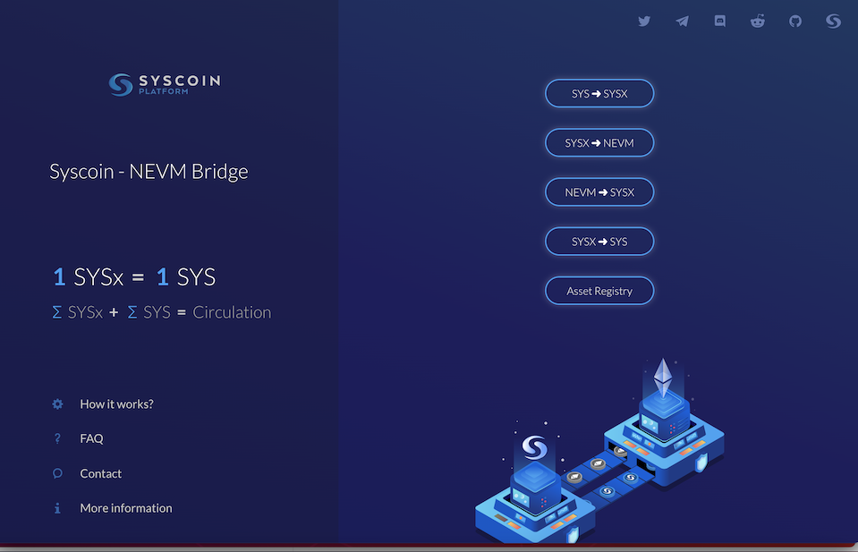

## Sysethereum DAPP
This is a reference implementation of a user interface showcasing the Syscoin <=> NEVM bridge. It will create a SPV proof of Syscoin burn transactions post to the relay smart contract which will validate and call a Relay contract which uses VaultManager to transfer from and to.

On the way back to Syscoin. An SPV proof of the NEVM transaction is created using [eth-proof](http://github.com/syscoin/eth-proof) and will call a burn function from the VaultManager base of the Syscoin Token contract that holds the tokens. It's purpose is to store and transfer tokens and the function parameters are used via ABI data to detect the value of the burn once Syscoin consensus reads the transaction data.

Syscoin itself enforces the SPV proofs of existence of transactions between the chains. The full EVM and UTXO states are known to each other and validated 1:1 for each block. Syscoin nodes run a custom version of Geth which validates NEVM blocks and speaks to Syscoin over ZMQ socket transport layer. The Transaction root is queried for when a Syscoin mint transaction is created (when NEVM contract transfers Syscoin tokens to the Vault Manager contract). The calculated Transaction Root must match the Transaction Root saved locally by each node which validates that the NEVM transaction was valid and subsequently transferring to the user. The total supply of Syscoin will remain constant throughout the process as the bridge represents a zero-sum game.
## Dependencies

1) Just Pali chrome extension wallet and Metamask!
2) You should configure `config.js` to point to your Web3 setup and explorer links if you are testing on a different network.

## Available Scripts

In the project directory, you can run:

### `npm start`

Runs the app in the development mode. 
Open [http://localhost:3000](http://localhost:3000) to view it in the browser.

The page will reload if you make edits. 
You will also see any lint errors in the console.

### `npm test`

Launches the test runner in the interactive watch mode. 
See the section about [running tests](https://facebook.github.io/create-react-app/docs/running-tests) for more information.

### `npm run build`

Builds the app for production to the `build` folder. 
It correctly bundles React in production mode and optimizes the build for the best performance.

The build is minified and the filenames include the hashes. 
Your app is ready to be deployed!

See the section about [deployment](https://facebook.github.io/create-react-app/docs/deployment) for more information.

### `npm run build` fails to minify

This section has moved here: https://facebook.github.io/create-react-app/docs/troubleshooting#npm-run-build-fails-to-minify
